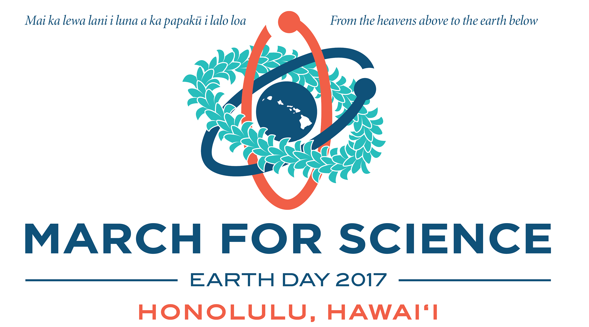
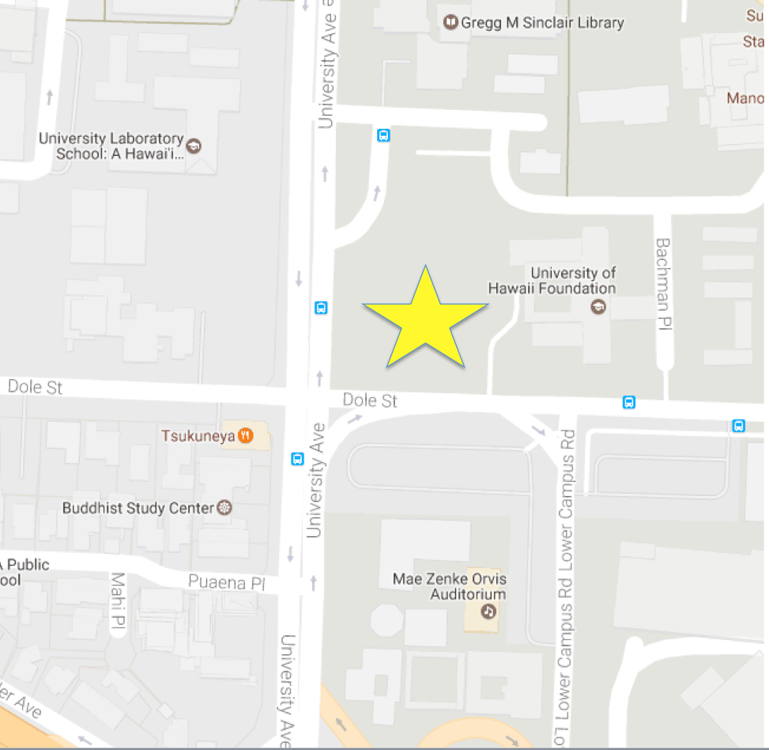

  

    
  

  

    <h1 class="ui title-font">Saturday, April 22, 2017, 3-7pm </h1>
  

  

    

      
    

    
    

      
Meet at University and Dole St. (Bachman Lawn), UH Manoa 

      
3pm - 6pm: Speakers, exhibits, music, food

      
4pm - 5pm: 1 Mile March (UH to Stadium Park and back)
  
    

  

  

 

   <h1 class="ui title-font">Mission and Principles</h1>
 

 

   

     
The March for Science Hawaiʻi celebrates the scientific process <em>mai ka lewa lani i luna a ka papakū i lalo loa</em> (from the heavens above to the earth below). We celebrate science as a foundation to explore life, understand the universe, foster global well-being, and advocate for it to be open, inclusive, and accessible.
 
     
     

       
We encourage people to recognize, appreciate, and engage with science and technology to ensure the long-term sustainability of our ‘āina and the impact of science in our daily lives.

       
We seek to build and sustain a diverse and inclusive scientific community of all scientists, teachers, practitioners, and other stakeholders.

       
We believe that scientists must be allowed to communicate their results freely, without misrepresentation, distortion, or fear of retribution.

       
We support science education that teaches children and adults to think critically, ask questions, and evaluate truth based on the weight of evidence.

       
We advocate political decision-making that makes use of validated knowledge-systems, evidence, and scientific consensus.
 
     

   

 

 

   <h1 class="ui title-font">Local Endorsements</h1>
 

 

     
     
     
     
     
     
     
     
    
  

 

   <h1 class="ui title-font">I march for science because...</h1>
 

 
 

   

   
   
In this two minute video, Hawaii citizens explain why they march for science

 

 
  

